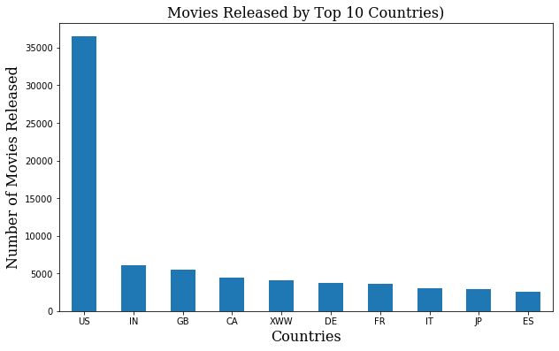
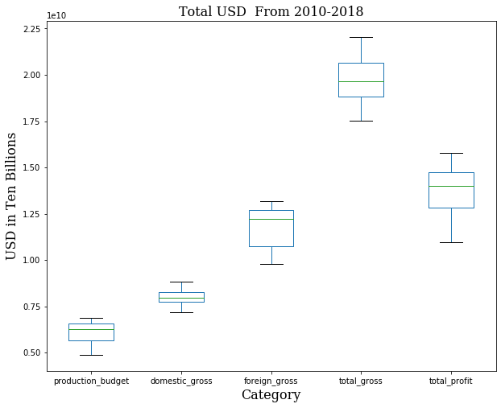
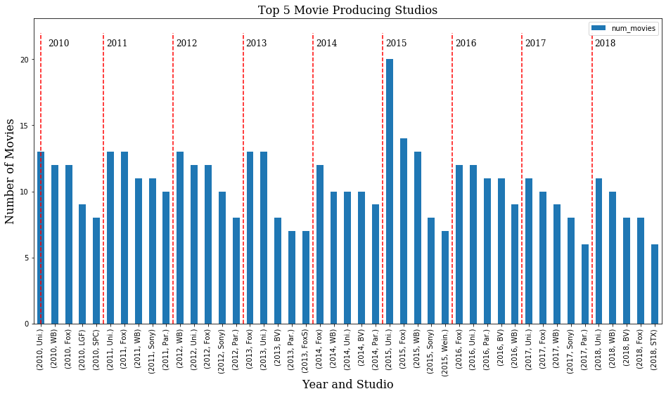

## Exploratory Data Analysis on Movies

## TL;DR
 - USA makes the more movies than the next three top movie producing countries.
 - Majority of the movies are profitable, either domestic or foreign or both. 
 - Studio of the movie does not seem to matter. However, the power of a studio might have an effct on the scripts/directors/writers/etc. (extrapolating). 
 - Entering as a brand new studio might be difficult, especially when larger studios are releasing more than 10 blockbuster titles a year. 
 - From 2010 to 2018, Buena Vista (subsidary of Disney) had the highest grossing out of all studios at \$31,818,940,000 - with net profit at \$22,428,140,000 but stuidio with the best return on investment from 2010-2018 is Warner Brothers and Universal Studios. 

## Overview

# Business Problem
Microsoft has recently lost trying to acquire Tik-Tok to Oracle and Walmart. Now Microsoft would like to allocate that money in creating their own original video content after seeing the success of Netflix, Hulu and Amazon Prime Video. 

# Data 
This exploratory data analysis (EDA) is conducted on the Box Office Mojo (bom) database, The Movie Database (tmdb), International Movie Database (imdb) and TN database. This EDA will assist Microsoft in considering if they should enter the Movie industry. Using the information from these different databases, I illustrate my findings and advise what the next steps should be for Microsoft.

# Result 

US is the highest movie producing country. In fact, US makes more movies than the next top three movie producing countries or the last five countries from the Top 10 Movie producing countries. 

Overall, the movie industry is very profitable, both domestically and foreign

               
 
        
        
Be that as it may, for Microsoft to enter the market as a new studio and compete with the larger movie industry dominators will be difficiult. 
 
   

## Conclusion

I would recommend Microsoft to partner with the larger studios and create a streaming platform which interacts with their virtual assisant, Cortana, which is already loaded in most Windows computers. 
After launching their streaming platform, then we can revisit which genre, director, writer, actor, etc. would be the best fit to persue.  

# Next Steps

If Microsoft would stil like to persue with the film division, then I would like to webscrape and have additional data from Netflix, Hulu, NBC's Peacock and Amazon Prime Videos. It would be fruitful to look into not just movies and films but also consider television series. 

Additionally, I would try to generate a Machine Learning algorithm that would analyze previous scripts, raitings and reviews from the web and predict how a movie will perform based on a script, director and actors information. 

# For more information
Please read my [full analysis](https://github.com/dorjeys3/Movies-Analysis/blob/master/Microsoft%20Movie%20Analysis.ipynb) for further clarification. 
For additional information on the project and myself, please concat me at Dorjeys3@gmail.com 

# Repository Contents
>`images`:Folder with images used in the project
>`rawdata`:Folder with raw data used for data cleaning
>`zippedData`:Folder with all the data from imdb, tn, tmdb and bom provided by Flatiron School
>`.gitignore`:Please ignore
>`Microsot Movie Analysis.ipynb`:Cleaned data for review
>`Movie Analysis Presentation`:PDF of my Presentation
>`README`:Preview file for GitHub Repo

